# IMPRESSORA -----> SOLUCIÓ
## Activitat 1: vista de Linux.
1. Hem creat una impressora amb cups i configurat cups seguint [aquest tutorial](https://github.com/XaSaFa/MP04/blob/main/uf3/compartir_impresora_linux.md) de l'apartat 1 a 5.  
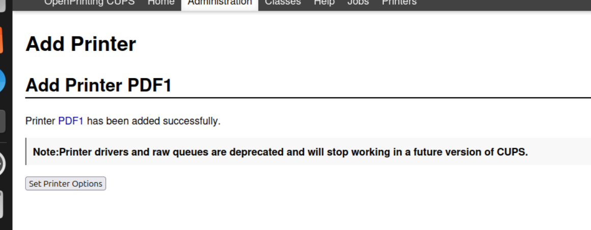
2. Hem instal·lat Samba:  
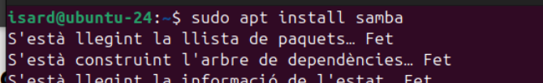
3. Hem editat la configuració de Samba per compartir les impressores del sistema:  
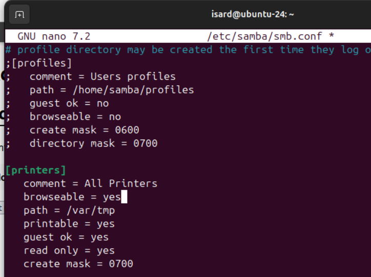
4. Hem reinciat samba:  
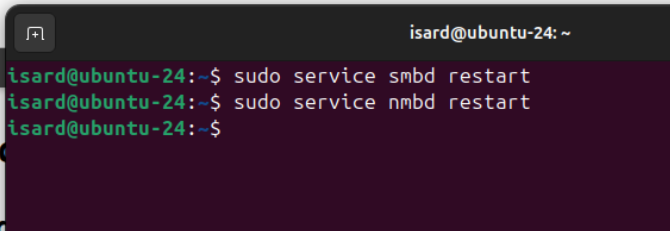
5. Aqui veiem la pàgina de prova rebuda de Windows.  
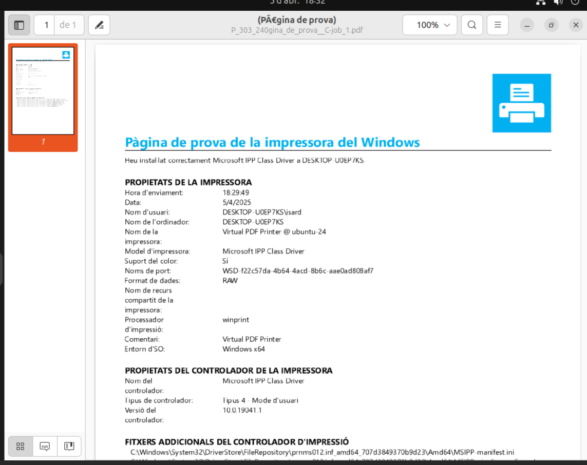

## Activitat 1: vista de Windows.
1. Anem al panell de control i seleccionem dispositius i impressores.
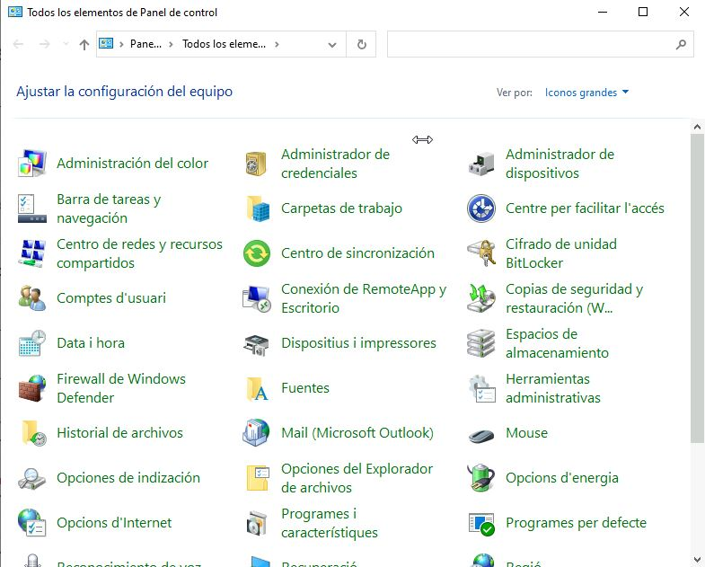
2. Li donem a afegeix una impressora
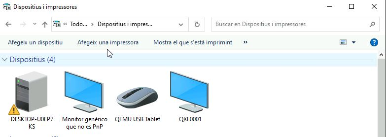
3. Seleccionem la impressora de Linux i li donem en seguent.
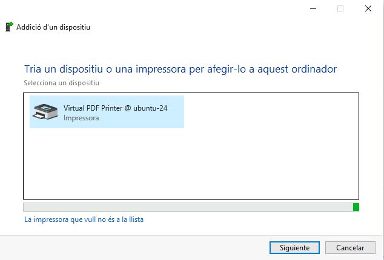
4. Seleccionem imprimeix una pàgina de prova per fer una prova, i li donem a finalitzar.
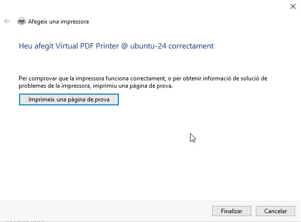

---------------

## Activitat 2: vista de Windows. 
1. Hem Instal·lat PDF creator:

2. Anem a al panell de control i seleccionem dispositius i impressores.

3. Li hem fet clic dret a la nostra impressora i li donem a propietats de la impressora.
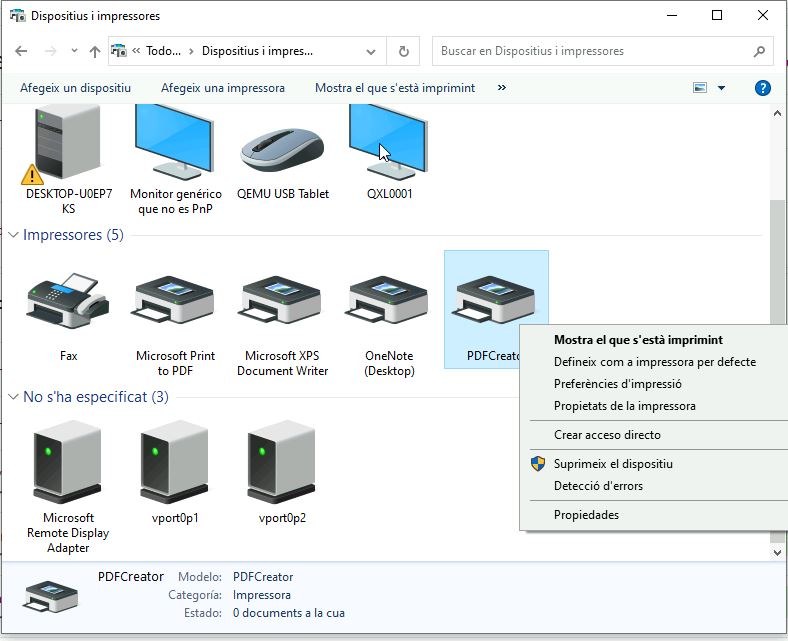
4. Anem a ús compartit i activem la opció comparteix aquesta impressora, i canviem el nom del recurs compartit, li donem a aplicar i acceptar.  
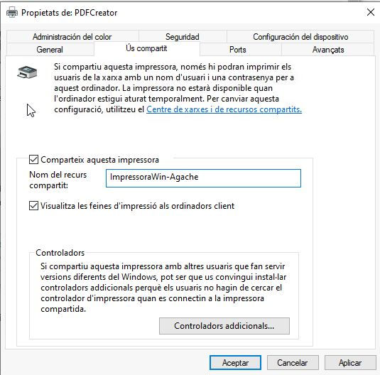

## Activitat 2: vista de Linux.
1. Hem instal·lat smbclient.  
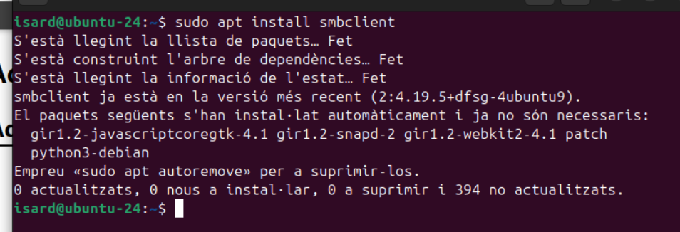
2. Hem obert localhost:631 (cups) al ordenador en administració.  
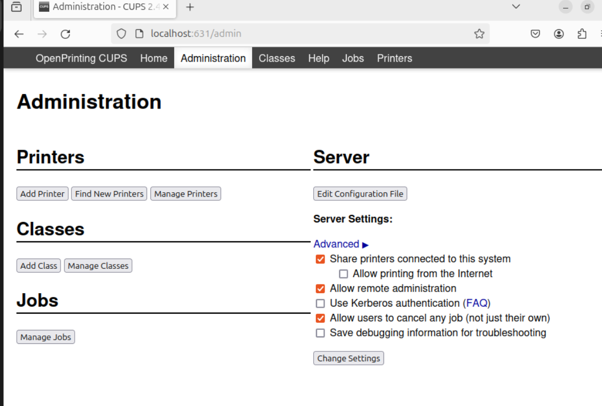
3. Hem fet "Add Printer" i sel·leccionat "Windows Printer via SAMBA".  
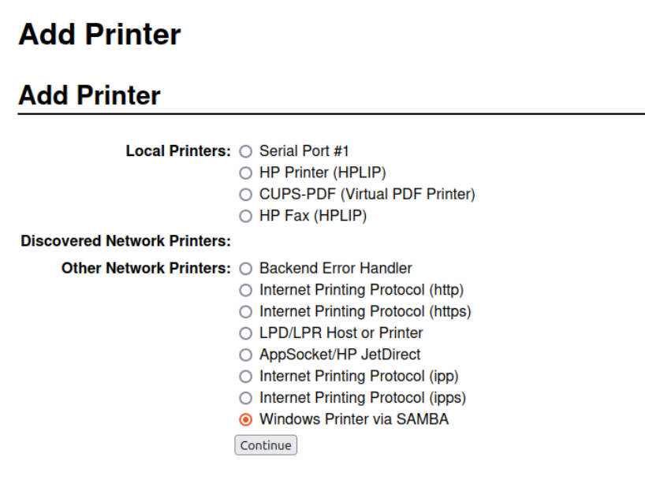
4. Hem ficat la IP, usuari contrasenya i nom de impressora de la màquina Windows.  
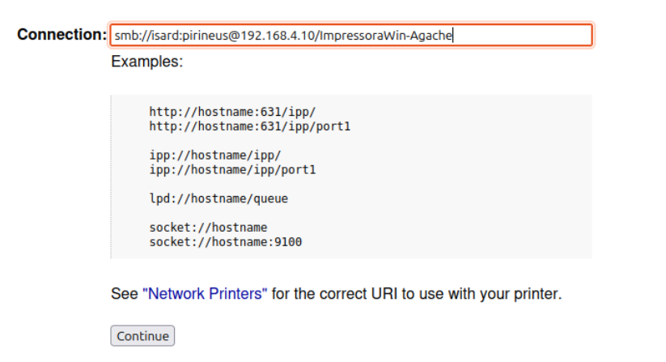
5. Hem ficat un nom a la impressora.  
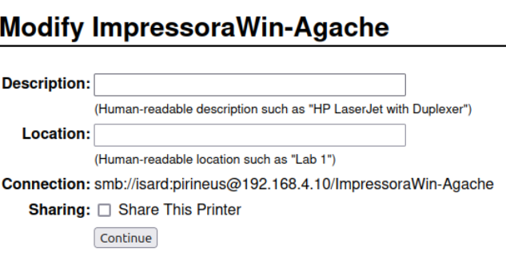
6. Hem ficat el model i afegit la impressora.  
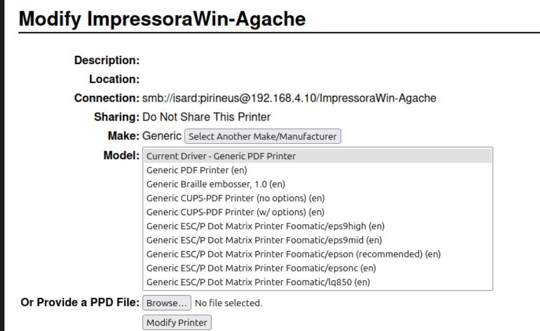

7. Aquí imprimem una pàgina de prova.  
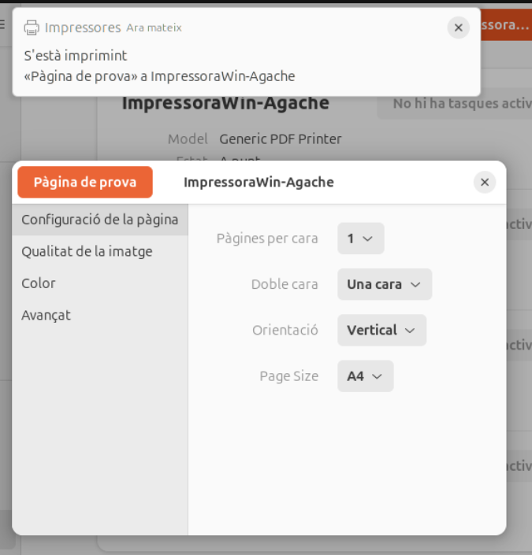
8. Al cups veiem que se ha imprimit.  
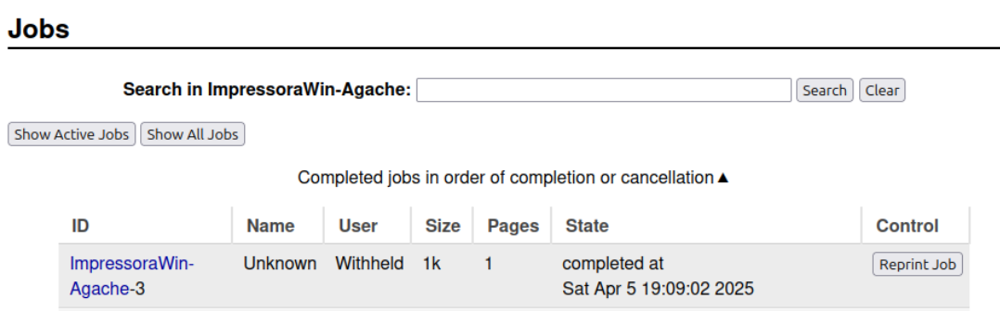
